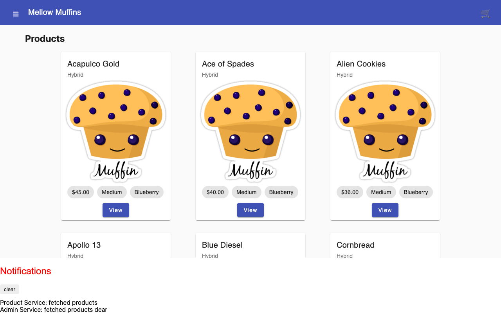
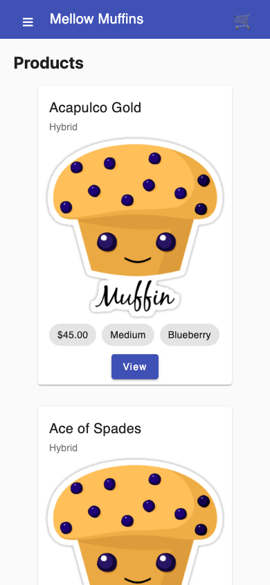

# Mercury — Mellow Muffins

A muffin shop demo with product browsing, a shopping cart, and an administration area. Angular uses a local in-memory API, so you can explore the whole demo without a backend or account.

## What you can do

- Browse nine sample products and view product details.
- Add products to a cart and compare shipping prices.
- Search, create, edit, and delete products in the admin area.
- View example orders and application notifications.

## Preview



Captured from the running application on September 30, 2026. Any sample records shown are demonstration or isolated test data, not data included with a fresh installation.

<details>
<summary>Mobile view</summary>



</details>

## Run locally

Use the Node version in `.nvmrc` (currently 26.10.0) and npm. Run these commands from the repository root.

```sh
nvm use  # if you manage Node with nvm
npm ci
npm start
```

Open [http://127.0.0.1:4200](http://127.0.0.1:4200). Keep the server in the foreground; stop it with **Ctrl+C**.

## Current scope

The Purchase action clears the cart and form and logs the entered details; it does not charge a card or persist an order. Reloading restores the in-memory sample data. The bundled muffin illustration comes from the [original catalog image](https://i.pinimg.com/originals/56/cf/33/56cf331bc11c0097b7ba5c10fbca8b62.png).

## Development

```sh
npm run build
npm run typecheck
npm test -- --browsers=ChromeHeadless
```

Browser tests require Chrome or Chromium; set `CHROME_BIN` if it is outside the standard installation path. Angular 22 currently requires TypeScript 6.0.x. The Jasmine 6 test dependencies are retained for compatibility with Zone.js.
